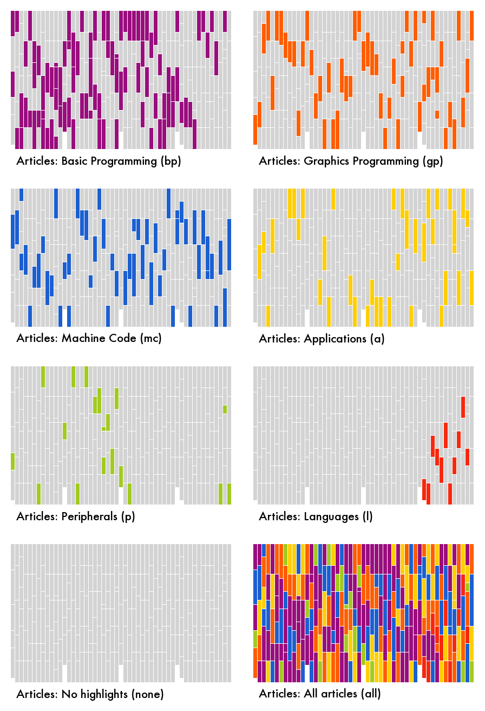

# INPUT magazine articles extractor

This is a Python script that uses `qpdf` to build PDF collections of articles in a given series. See scanInput.py for more details.

You'll need to install qpdf (e.g. `brew install qpdf`).

There is also a script that can generate pngs showing where in the publish run of input articles of a certain type appeared (visualiseInput.py).
You'll have to install pillow first (`pip install pillow`).

# Stats on INPUT magazine contents

See `Input magazine content tagging.csv`.

# INPUT magazine minutiae and notes

* The peripheral series is not numbered

* P article in issue 50 has no name

* one of thew machine code articles claims m/c is nice and easy, not like HLLs!

* mc sprite routines were using the usual &FFEE usual printing routine – kind of pointless?

# The article charts as a poster

